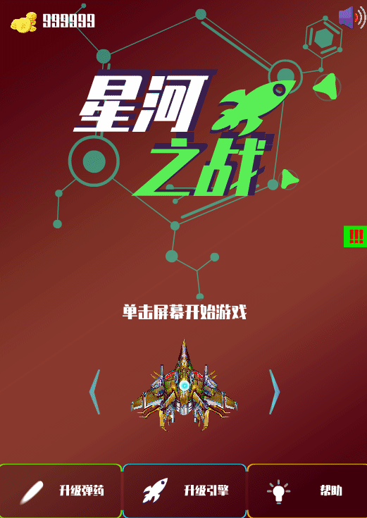
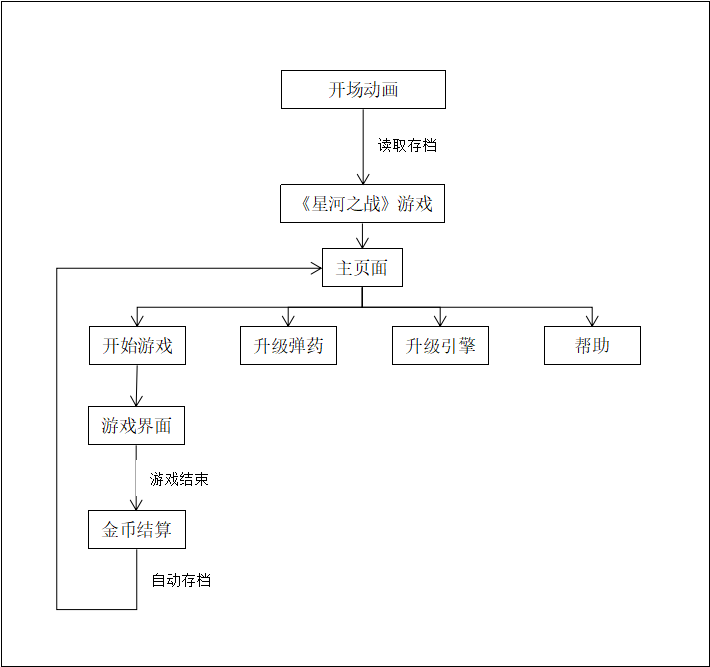

# 星河之战

使用`flash` + `as3`开发的小游戏

## 主界面



## 常见问题

若出现如下错误提示：

```
游戏场景, 图层'AS', 帧 402，147 行	1137: 参数个数不正确。不应超过 0 个。
```

- 请在flash菜单栏依次点击"编辑"->"首选参数"->"ActionScript"->"ActionScript3.0设置"，在"ActionScript3.0高级设置"对话框的"源路径"栏目内点击"+"按钮，输入".\as"并点击确定。

- 或者 将as文件夹内的".as"文件移动到项目根目录。

## 结构


